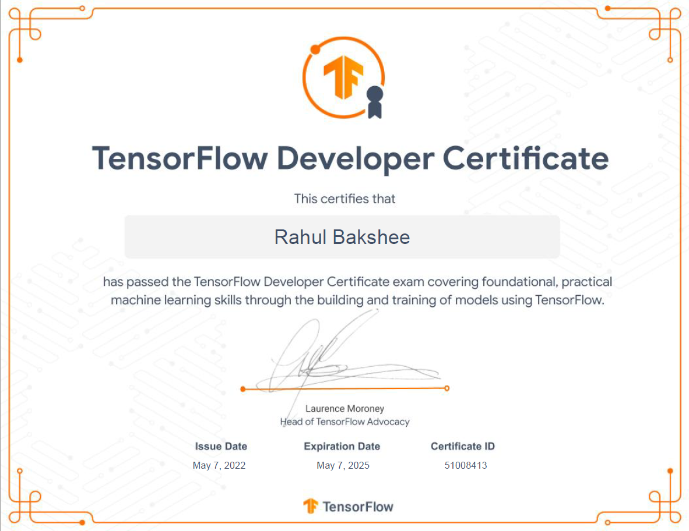
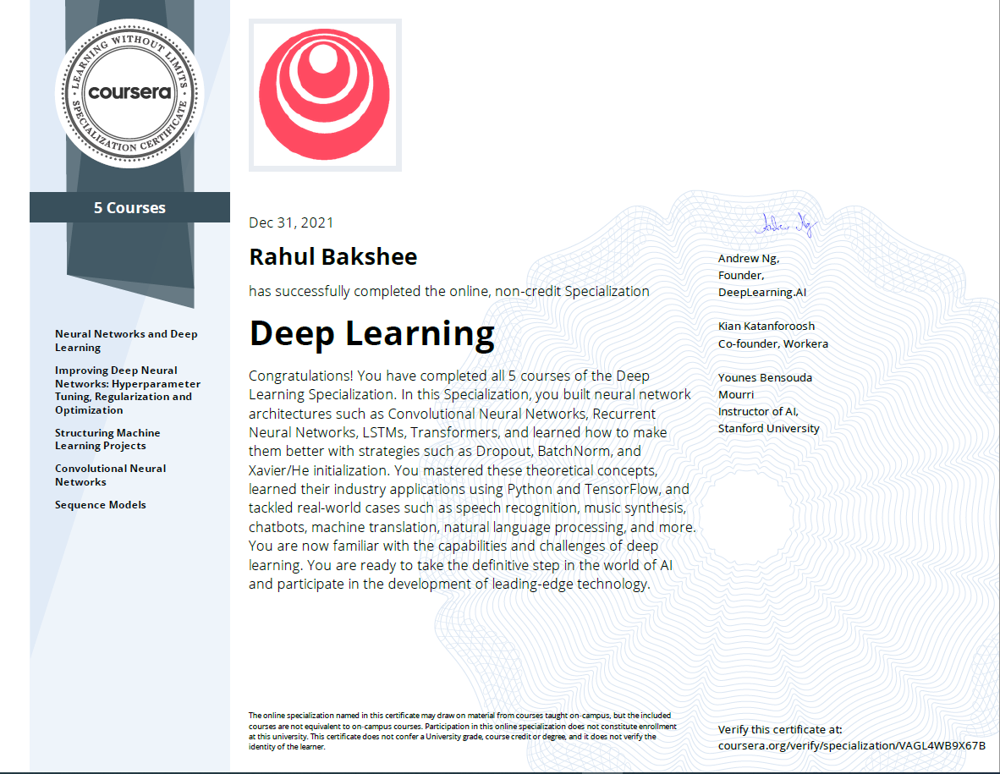

### Hi there 👋👋👋

🔭 A lifelong learner, passionate about creating insights & products using data. 🚀 In my 11+ years of professional journey, I have worked on real world business problems across domains (Manufacturing, Retail, Sales & Services, Consulting, Telecom, Pharma etc.) in variety of roles from Engineering to Data Science.

🏭 Currently working as Senior Data Scientist in DS&D(Data Science and Digital) arm at [Novartis](https://www.novartis.com/) where I am leading a team of 10+ Senior Data Analysts and junior Data Scientists through Business Understanding to Requirement Gathering and from Design to Modeling & Validation. As we are focused on improving Prescription/Medication Order writing through promotional recommendations, we are trying to create robust product to scale it to onboard 3+ brands impacting 70K+ Healthcare Professionals across 10+ channels. Other tasks involve working on Information Retrieval, User Ranking, Segmentation, Personalization, Customer Behavioral Analysis, Churn Analysis, Rare Event Detection & Class Imbalance.

🔥 Expert in Artificial Intelligence, Machine Learning, Deep Learning, Computer Vision, Neural Networks, Image Processing, Convolutional Neural Networks (CNN), Recurrent Neural Networks (RNN), Natural Language Processing, LSTM/GRU, Classification, Regression, Clustering, Bagging, Boosting, Object Detection, Semantic Segmentation.

🤓 Heavily involved in all phases of Machine Learning Software Development and Delivery namely Business Intelligence, Business Understanding, Stakeholder Management, Data Structures and Algorithms, Data Gathering, Data Loading, Exploratory Data Analysis, Dimensionality Reduction, Visualization, Data Preprocessing, Feature Engineering, Feature Selection, Modeling, Model Selection, Cross Validation, Metrics, Loss, Optimization, Hyperparameter Tuning, Stacking, Ensemble, Deployment.

🔨 Tools I use frequently are Python, Pandas, SQL, Numpy, Scipy, Matplotlib, Seaborn, Scikit-Learn / sklearn, Optuna, OpenCV, TensorFlow, Keras, PyTorch, Spark/PySpark etc.

📫 Say Hello at : 
[blog](https://rahulbakshee.github.io/iWriteHere/) , 
[linkedin](https://www.linkedin.com/in/rahulbakshee/) , 
[twitter](https://twitter.com/rahulbakshee) , 
[github](https://github.com/rahulbakshee) 

🥇 Certifications I recently did are:
- [TensorFlow Developer Certificate | Google Developers ](https://www.credential.net/3804a043-b11d-42a0-adc6-80c34aadb592)

- [Deep Learning Specialization | DeepLearning.AI ](https://rahulbakshee.github.io/iWriteHere/2021/12/31/Deep-Learning-Specialization.html)

- [Google Cloud Essentials | Google Cloud ](https://www.cloudskillsboost.google/public_profiles/2f9a816f-2ea9-4674-8a5d-9c5748dba843)

<!--
**rahulbakshee/rahulbakshee** is a ✨ _special_ ✨ repository because its `README.md` (this file) appears on your GitHub profile.

Here are some ideas to get you started:

- 🔭 I’m currently working on ...
- 🌱 I’m currently learning ...
- 👯 I’m looking to collaborate on ...
- 🤔 I’m looking for help with ...
- 💬 Ask me about ...
- 📫 How to reach me: ...
- 😄 Pronouns: ...
- ⚡ Fun fact: ...
-->
