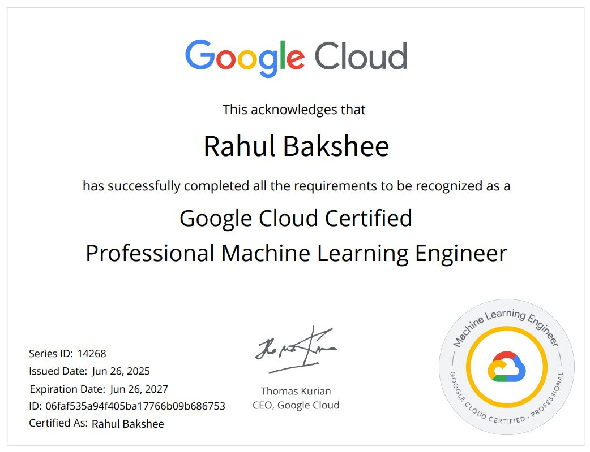
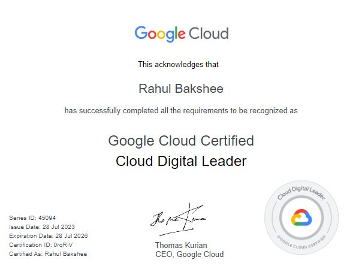

### Hello World 👋👋👋
🦾 Google Cloud Certified Professional Machine Learning Engineer with 13+ years of experience building production ML, DL and GenAI systems that drive revenue, reduce cost, and improve user engagement at scale.

🔥 Led AI platforms that delivered over $16M in annual revenue impact, 70%+ lifts in customer engagement, $5M+ in yearly cost savings, and protected multimillion‑dollar revenue through patient adherence, churn reduction, and fraud prevention initiatives.

🚀 Specializes in hybrid retrieval pipelines, ranking, re‑ranking, and end‑to‑end RAG pipelines and Agentic AI systems, recommendation systems, combining TensorFlow, PyTorch, and traditional ML with strong MLOps across GCP Vertex AI, AWS SageMaker, and Azure ML to support 50M+ daily events with sub‑second latency.

🛠 Operates at staff level by owning ML roadmaps, defining metrics & experimentation frameworks, and setting engineering standards for production models, while mentoring teams and partnering with VP/SVP‑level leaders to turn ambiguous business problems into scalable, reliable AI platforms.

✌️ Strong believer in Collaboration, Responsible AI, Diversity and Inclusion.

📫 Say Hello at : 
[blog](https://rahulbakshee.github.io/iWriteHere/) , 
[linkedin](https://www.linkedin.com/in/rahulbakshee/) , 
[twitter](https://twitter.com/rahulbakshee) , 
[github](https://github.com/rahulbakshee) 

🥇 Certifications I recently did are:
[Google Cloud Professional Machine Learning Engineer](https://www.linkedin.com/posts/rahulbakshee_machinelearning-ml-ai-activity-7345268047143686144-EFEL)

- [Google Cloud Digital Leader | Google Cloud ](https://www.linkedin.com/feed/update/urn:li:activity:7092018468090245121/)

- [TensorFlow Developer Certificate | Google Developers ](https://www.credential.net/3804a043-b11d-42a0-adc6-80c34aadb592)

- [Deep Learning Specialization | DeepLearning.AI ](https://rahulbakshee.github.io/iWriteHere/2021/12/31/Deep-Learning-Specialization.html)

<!--
**rahulbakshee/rahulbakshee** is a ✨ _special_ ✨ repository because its `README.md` (this file) appears on your GitHub profile.

Here are some ideas to get you started:

- 🔭 I’m currently working on ...
- 🌱 I’m currently learning ...
- 👯 I’m looking to collaborate on ...
- 🤔 I’m looking for help with ...
- 💬 Ask me about ...
- 📫 How to reach me: ...
- 😄 Pronouns: ...
- ⚡ Fun fact: ...
-->
